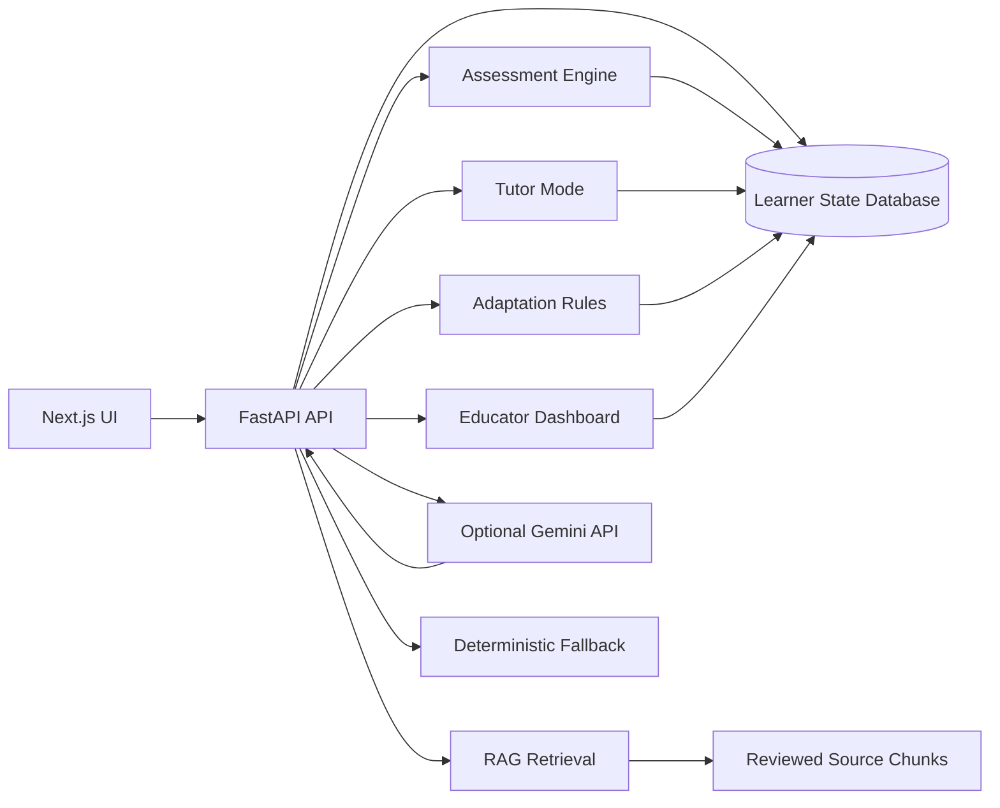

# LearnShift AI Architecture

## Overview

LearnShift AI combines a Next.js frontend, FastAPI backend, SQLAlchemy persistence layer, balanced Java OOP RAG content, adaptive assessment logic, tutor mode, educator analytics, and responsible AI safeguards.

## Data Flow

1. Learner answers diagnostics, assessment items, or tutor prompts.
2. Backend records interaction evidence.
3. Adaptive logic updates mastery, confidence history, hint counts, misconceptions, and recommendation.
4. Adaptation rules select teaching action or assessment difficulty.
5. RAG retrieves grounded content from balanced Java OOP chunks.
6. Educator dashboard aggregates class mastery, misconceptions, alerts, evidence, and AI usage logs.

## Persistence

Tables include learners, concepts, content chunks, questions, hint ladders, misconceptions, learner mastery, interactions, assessment attempts, educator alerts, AI usage logs, and adaptation rules.

## Offline Mode

The app runs without `GOOGLE_API_KEY`. In that mode, RAG retrieval uses deterministic keyword matching and fallback responses grounded in local source chunks.
